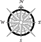
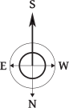

# Carto Elements
A collection of north arrows, scale bars, and other cartographic elements. Use the SVGs in QGIS or the EMFs in ArcMap. Alternatively export to Illustrator then bring in the elements and scale/rotate/modify as needed.

Visit [elza.me/cartoelements](http://elza.me/cartoelements) to view them all.

## Examples

### North Arrows:
&nbsp;&nbsp;&nbsp;&nbsp;&nbsp;&nbsp;&nbsp;&nbsp;
&nbsp;&nbsp;&nbsp;&nbsp;&nbsp;&nbsp;&nbsp;&nbsp;&nbsp;&nbsp;&nbsp;

### Scale Bars:

## Contribute
There a couple of ways you can contribute.

### Create your own:
Create your own cartographic element and submit a pull request. For the larger version use the suffix *_2x* and for the smaller version use the suffix *_1x*. Files to include:
1. The source. This can be an adobe illustrator file, inkscape svg, or what ever file you worked from to create the element.
2. A large and small version in SVG format. 
3. A large and small version in EMF format.

### Request
If you don't think you have the means to create your own, you can make a request through GitHub by submitting an issue. Just include a picture example of what you would like to see added to the site. If you are having a hard time submitting an issue, you can alternatively send me a message over social media. You can find links to my socials here: [elza.me](http:/elza.me)
